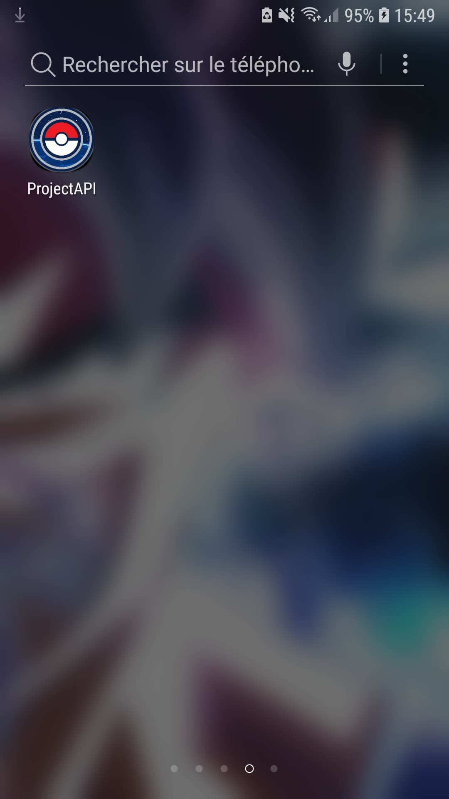
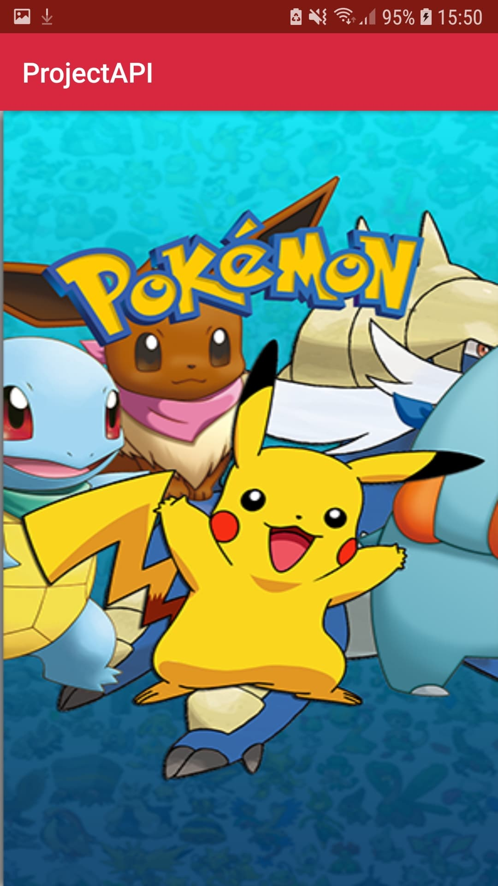
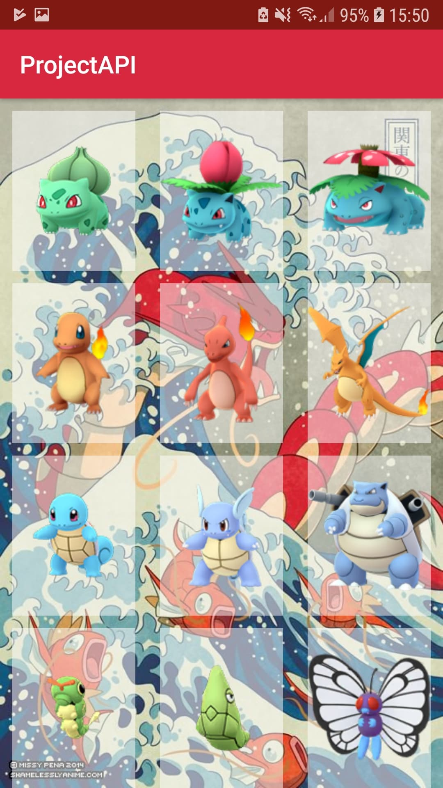
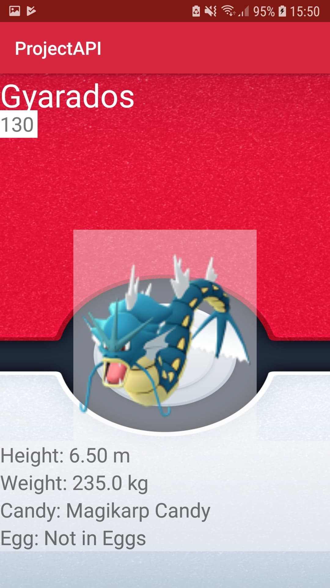
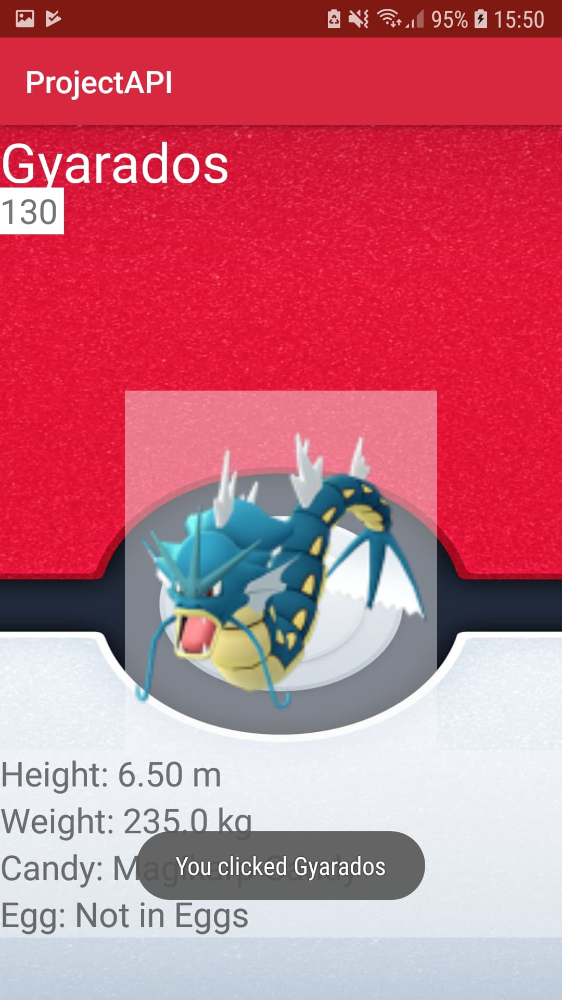

<h1>Projet Mobile Pokémon</h1>

Issam MALLEK
classe 33

<h2>Présentation</h2>

Le but de ce projet est de réaliser une application mobile qui execute un appel API et qui ouvre un second écran avec des détails, lors d'un clique sur l'un des éléments de la liste.

Cette application affiche une grille de pokémon et lors du choix d'un élément de la liste, une fiche détaillé du pokemon s'ouvre alors donnant sa taille, son poid et plusieurs informations complémentaire.

<h2>Prérequis</h2>
<ol>
 <ul>- Installation d'Android Studio</ul>
 <ul>- Récupérer une API</ul>
</ol>

      https://raw.githubusercontent.com/Biuni/PokemonGO-Pokedex/master/pokedex.json/pokemon

<h2>Consignes respectées:</h2>

<ol>
 <ul>Appels API</ul>
<ul>Ecran: 2 activités</ul>
 <ul>Affichage d'une liste dans un RecyclerView</ul>
<ul>Affichage du détail d'un item de la liste</ul>
 <ul>Fonctions supplémentaires:</ul> 
  <ol><ul>-Affichage en grille</ul>
   <ul>-Ecran d'accueil de 5s</ul>
   <ul>-Message qui indique l'item choisi</ul>
   <ul>-Icon</ul></ol>

<h2>Fonctionnalités:</h2>

<strong>Icon de l'application:</strong>
<ol><ul>-Icon permettant d'identifier l'application</ul></ol>

<strong>Premier écran:</strong>
<ol><ul>-Splash d'une durée de 5s affichant un écran d'accueil</ul></ol>
  
 

<strong>Deuxième ecran:</strong> 
  <ol><ul>-Affichage du pokedex avec la liste des 151 pokemon</ul></ol>
  
   
 
<strong>Ecran détaillé:</strong>
    <ol><ul>-Affichage plusieurs informations sur le pokemon tel que la taille, le poid, le type de bonbon ou encore le nombre de km nécessaire à l'éclosion de l'oeuf</ul></ol>
    
   
    
<ol><ul>-message obtenu lors du choix d'un pokemon</ul></ol>
    
    
